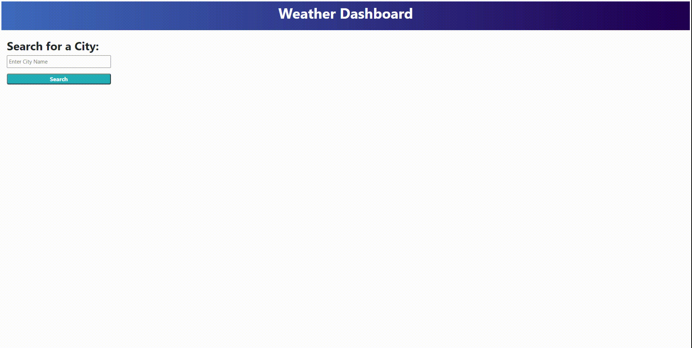

# Weather Dashboard

Create a weather application to show current weather and 5-day forecast of cities. Use the OpenWeather One Call API to retrieve weather data for cities.

---

## Table of Content

- [APIs](#apis)
  - [Geocoding API](#geocoding)
  - [One Call API](#one-call)
- [Search](#search)
- [Weather Information](#weather-info)
- [Screenshot](#screenshot)
- [Page Link](#page-link)

---

## APIs

Geocoding API and One Call API were used in this application.

### Geocoding API

The Geocoding API is used to get the latitude and longitude coordinates of named cities passed in the url link.

### One Call API

Using the latitude and longitude coordinates gotten from the Geocoding API, we can pass the coordinates into the API call for the One Call API to get the weather data for a city.

---

## Search

The search section has two parts: the search bar and the search history.

The search bar has a placeholder saying to enter a city name. When the search button under search bar is click, an API call with the city name will be made to the Geocoding API. If results are successfully found, then a search history item will be added to search history and the results will be passed to One Call API.

The search history is used to keep track of previous successful city searches. Users are able to click the previous city searches and the webpage will display the weather data. The search history is designed to not to have multiple instances of previous searches. All previous searches are presistent data meaning that they are stored in local storage and the place onto the webpage when loaded.

---

## Weather Information

Displayed weather information is separated into current weather information and 5 day forecast.

Current weather information is gotten from One Call API under current, which has temperature in fahrenheit, wind speed in miles per hour, humidity percentage, uvi, and weather icon. The uvi is color code indicated condition which are green for favorable (0 to 2), yellow for moderate (3 to 7), and red for severe (8 or higher).

Information for the 5 day forecast is also from One Call API but under daily (indexes 1 to 5). Like current, there wind speed in miles per hour, humidity percentage, and weather icon. Unlike current, daily only has temperature with lowest and highest and the page display the highest temperature.

---

## Screenshot

---

## Page Link

Link: https://ptran77.github.io/weather-dashboard/
